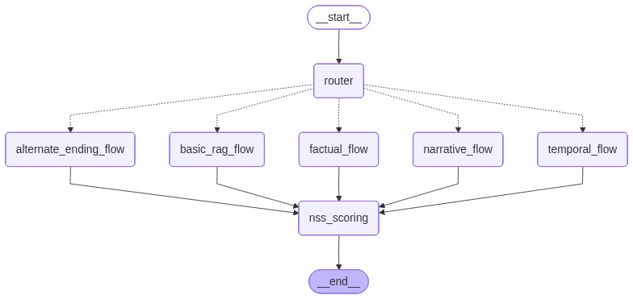

# 🧙‍♂️ Cosine of Thrones  
### A Multi-Agent LangGraph RAG System for Game of Thrones Reasoning, Retrieval, and Narrative Scoring

Cosine of Thrones is a fully-featured **multi-agent Retrieval-Augmented Generation (RAG)** system built for deep reasoning over the Game of Thrones universe (Seasons 1–7).  
It uses **LangGraph**, **hybrid search (FAISS + BM25)**, and a suite of specialized agents to produce factual answers, narrative analysis, emotional states, causal chains, alternate endings, and narrative-quality scoring (NSS).  

This is a research-grade system designed for experimentation, narrative QA, and agentic orchestration.

---

# ⚔️ Features

### 🔍 Hybrid Retrieval Engine
- FAISS vector search with L2 normalization  
- BM25 keyword search  
- Merged + deduped hybrid retrieval  
- Evidence scoring & re-ranking (gpt-4o-mini)  
- Season filtering rules (S1–7 only for alternate endings)  

### 👥 Multi-Agent LangGraph Orchestrator
Coordinates:

- **Query Decomposer Agent**  
  Extracts entities, canonicalizes names, and produces retrieval subqueries.
- **Temporal Agent**  
  Detects timeline hints, Season/Episode constraints.
- **Narrative Agent**  
  Summarizes story arcs and structural plot elements.
- **Causality Agent**  
  Extracts CAUSE → EFFECT reasoning chains.
- **Emotion Agent**  
  Extracts emotional states and sentiment from the evidence.
- **Basic RAG Agent**  
  Direct factual retrieval.
- **Alternate Ending Agent**  
  Generates new Season 8 endings using **only Seasons 1–7**.
- **NSS - Narrative Scoring System Agent**  
  Applies an 8-category weighted scoring rubric.

### 🧪 Evaluation Framework (NSS)
Weighted rubric categories:

| Category | Weight |
|---------|--------|
| Setting Consistency | 2 |
| Character Consistency | 4 |
| Character Motivation | 4 |
| Referencing Consistency | 3 |
| Conflict/Resolution Linkage | 4 |
| Theme Alignment | 3 |
| Macrostructure Cohesion | 4 |
| Creative Plausibility | 4 (alt endings only) |

Produces:

- Per-category score  
- Weighted score  
- Explanations  
- Total weighted score  

### 🎨 Interactive Gradio UI
- Left-side test prompt panel  
- LangGraph diagram included  
- Center panel for answer, evidence, analysis  
- Right-side NSS scoring panel  
- Collapsible evidence cards  
- Debug logs panel  

---

# 📐 Architecture Diagram

The LangGraph workflow diagram is stored at:

### 🧩 Agent Orchestration Diagram



Regenerate it anytime:

```bash
python -m ragthrones.scripts.generate_graph

# 🐺 COSINE-of-Thrones  
### A Full Game-of-Thrones Retrieval-Augmented Generation (RAG) + Agentic Pipeline

COSINE-of-Thrones is a custom-built RAG system that ingests **Game of Thrones subtitles, lore datasets, and external trivia**, builds a **hybrid vectorstore (FAISS + BM25)**, and runs a lightweight **LangGraph-style agent** written entirely in **plain Python**.

This project powers:
- Semantic + lexical hybrid retrieval  
- Narrative evaluation  
- Grounded Q&A with evidence citations  
- A modular agent pipeline (parser → retriever → reranker → synthesizer)  
- A Gradio-based interactive UI  

This README explains how to install, prepare data, build embeddings, and run the system locally.

---

# 📁 Project Structure

---

# 🚀 1. Installation & Environment Setup

## Step 1 — Create and activate the virtual environment  
(**IMPORTANT:** The env lives inside `ragthrones/`, not the project root.)

```bash
cd ragthrones
python3 -m venv myenv
source myenv/bin/activate
pip install -r requirements.txt

Create Env file
OPENAI_API_KEY=your_key_here

KAGGLE_USERNAME=your_username
KAGGLE_KEY=your_key

#Build Vector stores & KB with /notebooks and then run the below

python -m ragthrones.app.gradio_ui